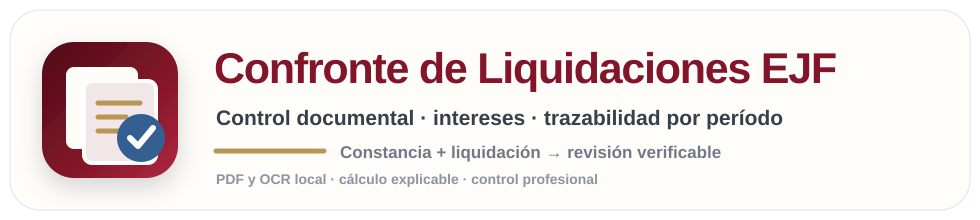
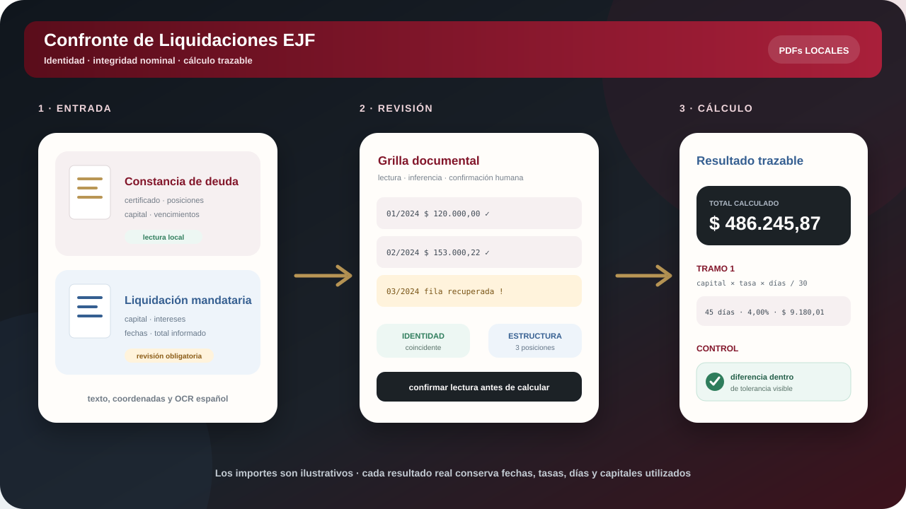

<p align="center">
  
</p>

<h2 align="center">Dos documentos. Una verificación trazable.</h2>

<p align="center">
  Control local de constancias de deuda, liquidaciones mandatarias e intereses en ejecuciones fiscales.
</p>

<p align="center">
  <a href="https://sinergiaestudio.github.io/Confronte-Liquidaciones-EJF-v2.1.0/"><strong>Abrir edición pública</strong></a>
  ·
  <a href="https://confronte-liquidaciones-ejf.arielmarcelogomez7.chatgpt.site">Abrir aplicación principal</a>
  ·
  <a href="https://sinergiaestudio.github.io/herramientas-j15sec29/">Herramientas SEC29</a>
  ·
  <a href="#privacidad-y-alcance">Privacidad</a>
</p>

<p align="center">
  
  
  
  
  
</p>

---

## Qué es Confronte EJF

Confronte de Liquidaciones EJF es una aplicación web para comparar una **constancia de deuda** con una **liquidación mandataria**, revisar la lectura de ambos PDFs y recalcular intereses con desarrollo por posición y por período.

La aplicación no se limita a declarar si dos totales coinciden. Separa el trabajo en capas verificables:

1. extrae texto y coordenadas del PDF;
2. clasifica el perfil documental;
3. reconstruye metadatos, posiciones y comprobantes;
4. permite corregir la lectura antes del cálculo;
5. controla identidad e integridad nominal;
6. recalcula intereses con tasas y fechas visibles;
7. compara cada componente informado con el calculado.

> **Leer, revisar, calcular y explicar: cada conclusión debe conservar su rastro.**

## Vista funcional

<p align="center">
  
</p>

## Qué controla

| Capa | Control | Evidencia visible |
|---|---|---|
| **Identidad** | Certificado, adjudicación y datos generales del documento. | Comparación de metadatos extraídos y corregidos. |
| **Integridad nominal** | Posiciones, comprobantes, capitales, vencimientos y filas faltantes. | Grilla editable y recuperación desde el documento contraparte. |
| **Tipo de ejecución** | Estándar, capitalización por facturas, capitalización por posiciones o deuda única. | Perfil detectado y reglas aplicadas. |
| **Intereses** | Resarcitorios, punitorios, capitalización y tramos posteriores. | Fechas, días, tasa mensual, capital base e importe por tramo. |
| **Resultado** | Diferencias entre lo informado y lo calculado. | Resumen general y desarrollo desplegable por posición. |

## Perfiles documentales

| Perfil | Documentos admitidos | Clave de comparación |
|---|---|---|
| **AGIP estándar** | Constancia y liquidación | Posición, vencimiento y capital. |
| **AGIP histórica** | Constancia y liquidación | Cuotas partidas, continuaciones verticales y OCR defectuoso. |
| **Capitalización por facturas** | Constancia y liquidación | Comprobante canónico, mora y capital. |
| **Capitalización por posiciones** | Constancia y liquidación | Posición y base capitalizada. |
| **Deuda única / cálculo combinado** | Constancia y liquidación | Capital, fechas y tramos resarcitorio-punitorio. |

Los identificadores originales se conservan para exhibición, pero se normalizan para el confronte. Por ejemplo, distintas formas gráficas de una misma factura pueden reducirse a una clave canónica común.

## Lectura y revisión

La extracción documental combina:

- `pdf.js` para texto y coordenadas;
- reconstrucción de renglones por posición visual;
- detección de documentos escaneados;
- OCR en español ejecutado localmente, con resolución reforzada para constancias históricas;
- parsers específicos por perfil;
- niveles de confianza y bloqueos explícitos;
- edición humana antes de aceptar la lectura.

Las correcciones realizadas en la interfaz forman parte de la sesión de trabajo, pero no alteran los PDFs originales.

## Cálculo de intereses

La fórmula base por tramo es:

```text
interés = capital × tasa mensual × días / 30
```

Cada desarrollo expone:

- fecha inicial y final;
- cantidad de días;
- tasa mensual aplicada;
- capital utilizado;
- interés del tramo;
- total acumulado;
- diferencia respecto del importe informado.

En las constancias AGIP históricas, el motor no desecha el coeficiente ya certificado. Separa el **interés incorporado a la constancia hasta “SALDO IMPAGO AL”** y recalcula únicamente la continuación hasta el inicio del juicio. Ambas partes quedan visibles en la ecuación de cada posición.

La cobertura vigente del motor termina el **31/12/2026**. La aplicación bloquea el cálculo cuando las tasas no cubren íntegramente el período y no extrapola valores futuros.

### Ejecuciones especiales con capitalización

El desarrollo conserva cuatro etapas:

1. resarcitorio sobre capital original hasta el inicio del juicio;
2. punitorio previo hasta la notificación de demanda;
3. capitalización de capital, resarcitorio y punitorio previo;
4. punitorio posterior sobre el total capitalizado.

## Resultado y exportación

La aplicación ofrece:

- resumen general del confronte;
- detalle desplegable por posición;
- auditoría de cada tramo;
- formato monetario argentino con centavos;
- tolerancia operativa visible del 5%;
- sesión JSON;
- exportación CSV;
- informe imprimible;
- instalación como PWA;
- funcionamiento sin conexión después de la primera carga.

## Identidad visual

Confronte EJF forma parte de **Herramientas SEC29**. La marca combina:

- dos documentos que deben corresponderse;
- una lupa de control;
- una marca de validación;
- una grilla de cálculo trazable.

La paleta bordó, grafito, marfil, azul técnico y dorado apagado comparte el lenguaje visual de Cédulas EJE, Diplomaker y la suite principal.

## Privacidad y alcance

- los PDFs se procesan en memoria local;
- no se envían documentos a un servidor;
- no existe base de datos de expedientes;
- la sesión JSON puede contener datos extraídos y debe tratarse como información sensible;
- los PDFs reales de aceptación no forman parte del repositorio;
- las pruebas versionadas utilizan datos sintéticos;
- la herramienta no reemplaza la revisión profesional;
- no constituye un sistema oficial del Consejo de la Magistratura de la CABA.

## Arquitectura

```text
app/
  components/       interfaz, revisión y resultados
lib/
  pdf/              extracción por coordenadas y OCR local
  parsers/          clasificación y perfiles documentales
  domain/           tipos, fechas, importes y normalización
  confronte/        emparejamiento, tasas y cálculo
public/
  ocr/              worker, WASM y modelo español
tests/              regresiones con datos sintéticos
```

## Desarrollo

Requiere Node.js 22.13 o posterior.

```bash
npm ci
npm run dev
```

Controles previos a publicación:

```bash
npm run lint
npm test
npm run build
```

La rama `main` compila y publica automáticamente la edición estática de GitHub Pages. Los recursos OCR se reconstruyen desde las dependencias fijadas; no se versionan documentos reales.

## Referencias normativas del motor

La regla general de tasas desde 2023 se mantiene aislada en `lib/confronte/rates.ts` para facilitar su revisión y actualización. Entre las referencias documentadas se encuentran:

- [Resolución 4323/MHFGC/2022](https://www.agip.gob.ar/normativa/resoluciones/2022/mhfgc/resolucion-n-4323-mhfgc--2022)
- [Resolución 360/AGIP/2022](https://boletinoficial.buenosaires.gob.ar/normativaba/norma/615104)
- [Calculador oficial de intereses del Consejo de la Magistratura](https://consejo.jusbaires.gob.ar/servicios/calculo-de-interes/)

Las tasas del primer y segundo semestre de 2026 fueron contrastadas nuevamente el 27/08/2026. La cobertura continúa cerrada al 31/12/2026: no se extrapolan tasas a períodos futuros.

## Repositorios relacionados

- [Herramientas SEC29](https://github.com/sinergiaestudio/herramientas-j15sec29)
- [Cédulas EJE](https://github.com/sinergiaestudio/Cedulas-EJE-v1.0)
- [Diplomaker](https://github.com/sinergiaestudio/diplomaker)
- [Perfil de Marcelo Gómez](https://github.com/sinergiaestudio/marcelo-gomez)

## Autoría

Diseño y desarrollo: **[Marcelo Gómez](https://github.com/sinergiaestudio)**  
Innovación aplicada a la gestión judicial.
